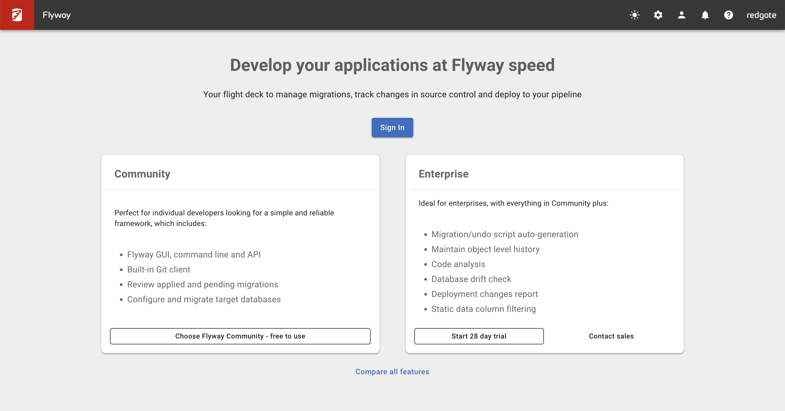
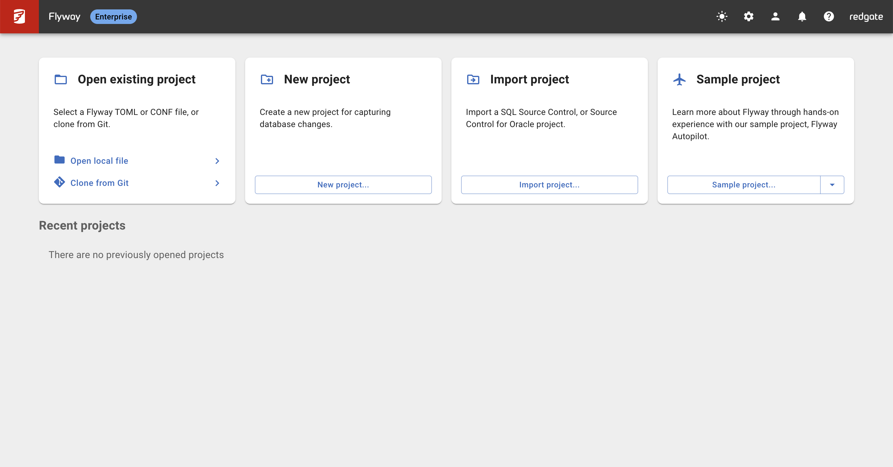

Welcome to Flyway AutoPilot! This lab covers the Azure SQL Database setup and AutoPilot configuration you need to get started with automated database deployments.

## What is Flyway AutoPilot?

Flyway AutoPilot provides a complete database DevOps solution with:

- Pre-configured CI/CD pipelines
- Template repositories with best practices
- Automated schema capture and migration generation
- End-to-end deployment automation

## 1. Prerequisites

### Accounts Required

- **GitHub Account**

  - You'll be using this repository as your codebase
  - Free accounts are sufficient for getting started

- **Flyway Enterprise Trial**
  - Sign up for a 28-day free trial at in the Desktop Application
  - This gives you access to all Enterprise features including AutoPilot

### Software Requirements

- **Flyway Desktop Enterprise**

  - Download from [Redgate website](https://documentation.red-gate.com/fd/installers-172490864.html)
  - Apply for the 28-day Enterprise trial to unlock AutoPilot features
  - Provides the graphical interface for schema capture and migration management

- **Git** (version 2.30 or higher)
  - Required for version control integration
  - Download from [git-scm.com](https://git-scm.com/)

### Database Access

Access to one of these supported databases:

- **SQL Server** (2012 or later)
- **Azure SQL Database**
- **PostgreSQL** (9.4 or later)
- **MySQL** (5.7 or later)
- **Oracle** (11g or later)

For this lab, we'll use the sample databases and configurations already provided in this repository.

## 2. Initial Setup

### Step 1: Use This Repository as Your Codebase

You're already in the right place! This `database-devops-autopilot` repository contains:

- Training materials and labs
- Sample database configurations
- Pre-configured CI/CD pipeline examples
- Best practice folder structure

**Note**: This repository serves as your learning environment and codebase for the training.

### Step 2: Set Up Flyway Desktop Enterprise

1. **Download Flyway Desktop** from the [Redgate website](https://documentation.red-gate.com/fd/installers-172490864.html)
2. **Apply for Enterprise Trial**:

   - During installation or first launch, select "Start Enterprise Trial"
   - Enter your email to get a 28-day free trial
   - This unlocks AutoPilot and all advanced features



3. **Launch the application** and complete the setup wizard

### Step 3: Explore the Flyway Dashboard

Once you have Flyway Desktop Enterprise running, you'll see the main dashboard:



The dashboard provides:

- **Project Overview**: Current schema state and migration history
- **AutoPilot Features**: Automated pipeline setup and monitoring
- **Schema Capture**: Tools for capturing and versioning database changes
- **Deployment Tracking**: Real-time visibility into deployments across environments

## 3. Verify Your Setup

### Check Git Installation

```bash
git --version
# Should show version 2.30 or higher
```

### Explore the Repository Structure

```
database-devops-autopilot/
├── training/flyway-autopilot/   # Training labs and materials
├── assets/images/               # Screenshots and diagrams
├── sample-databases/           # Sample SQL scripts (to be added)
├── .github/workflows/          # GitHub Actions examples
└── _config.yml                # Site configuration
```

### Verify Flyway Enterprise Trial

1. **Open Flyway Desktop**
2. **Check License Status**: Look for "Enterprise Trial" in the application
3. **Verify AutoPilot Access**: Ensure AutoPilot features are available in the interface
4. **Test Dashboard**: Confirm you can see the full dashboard as shown in the image above

## Next Steps

Once you have these prerequisites in place, you'll be ready to:

1. **Connect Flyway Desktop** to your database and repository
2. **Capture your first schema** and generate migration scripts
3. **Set up automated pipelines** for continuous deployment
4. **Test the end-to-end workflow** from development to deployment

## Verification Checklist

Before proceeding to the next lab, ensure you have:

- [ ] GitHub account ready
- [ ] Flyway Desktop Enterprise installed with 28-day trial activated
- [ ] Git 2.30+ installed and working
- [ ] This repository (`database-devops-autopilot`) accessible locally
- [ ] Flyway Dashboard displaying correctly
- [ ] Enterprise trial status confirmed in Flyway Desktop
- [ ] AutoPilot features visible in the interface

## Additional Resources

- [Official Prerequisites Guide](https://documentation.red-gate.com/flyway/getting-started-with-flyway/first-steps-flyway-autopilot-a-beginners-guide/flyway-autopilot-fasttrack/1-pre-requisites)
- [Flyway Desktop Enterprise Download](https://www.red-gate.com/products/flyway/desktop/)
- [Flyway Enterprise Trial Signup](https://www.red-gate.com/products/flyway/desktop/)

## Troubleshooting

**Enterprise Trial Issues**: If AutoPilot features aren't visible, ensure you've properly activated the Enterprise trial during setup.

**Git Version Issues**: Use `git --version` to check your version. Update if below 2.30.

**Dashboard Not Loading**: Restart Flyway Desktop and ensure your trial license is properly activated.

---

## 🔗 Navigation

**🏠 [Workshop Overview](/database-devops-autopilot/training/flyway-autopilot/labs/)** | **➡️ [Next: Lab 2 - Repository Configuration](/database-devops-autopilot/training/flyway-autopilot/labs/lab2-repository-configuration)**

---
