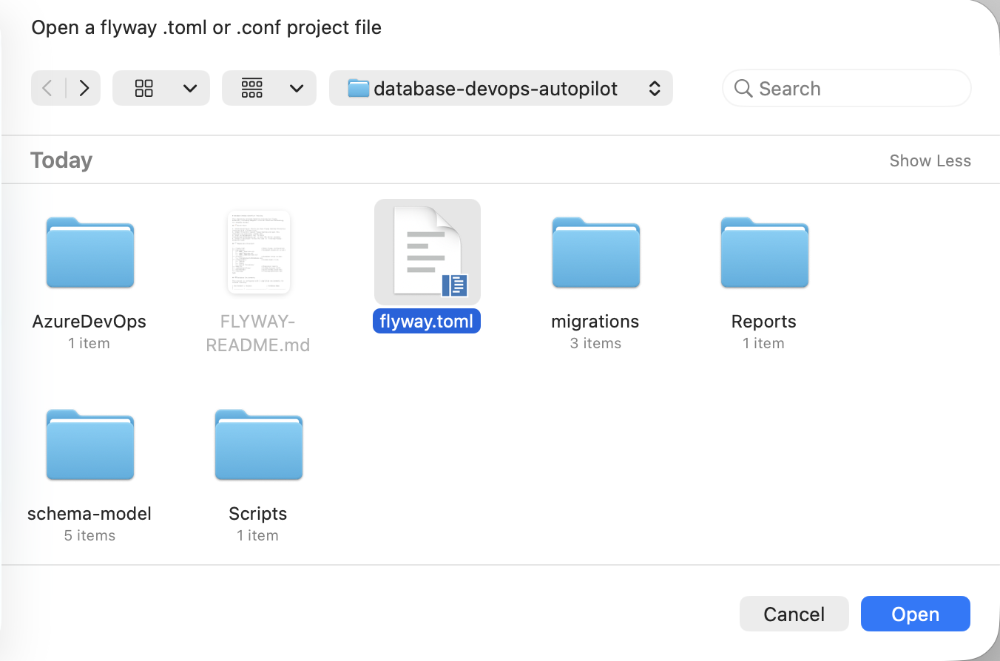
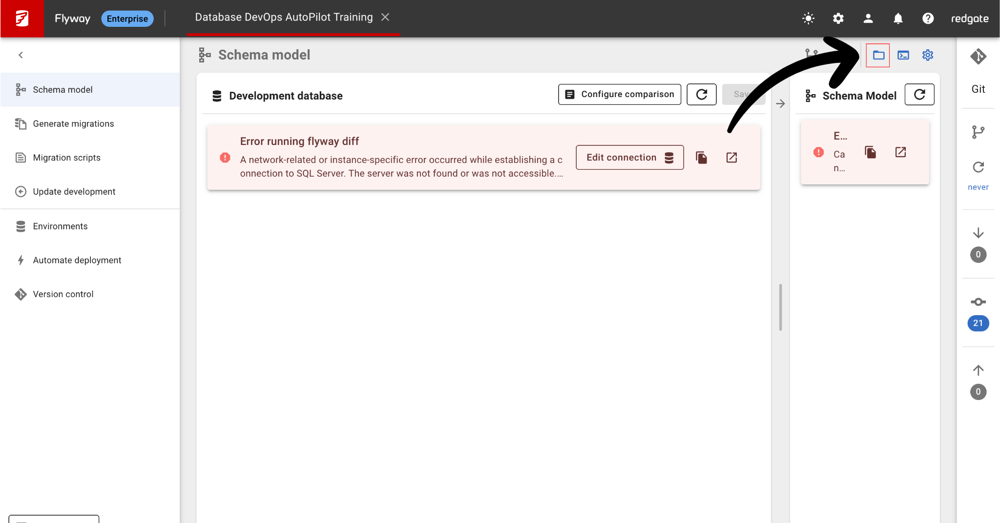

## Overview

In this lab, you'll set up this repository with Flyway Desktop and learn how to configure it for AutoPilot functionality. We'll use this training repository as your working environment and reference the official patterns from Redgate's best practices.

## Learning Objectives

- Connect this repository to Flyway Desktop
- Understand the project structure and configuration
- Set up Flyway configuration files
- Handle initial setup and connection configuration

## Prerequisites

- Completed Lab 1 (Flyway Desktop Enterprise installed with 28-day trial)
- This repository accessible locally (you're already here!)
- Git 2.30+ installed

## Step 1: Review Flyway Configuration

### 1. Review the flyway.toml Configuration File

The repository already contains a complete Flyway configuration based on the [official SQL Server FastTrack repository](https://github.com/red-gate/Flyway-AutoPilot-FastTrack).

Open and review the `flyway.toml` file in the root of this repository:

```toml
id = "database-devops-autopilot-training"
name = "Database DevOps AutoPilot Training"
databaseType = "SqlServer"

[environments.development]
url = "jdbc:sqlserver://localhost;databaseName=db-autopilot-dev-001;encrypt=true;integratedSecurity=true;trustServerCertificate=true"
displayName = "Development database"

[environments.uat]
url = "jdbc:sqlserver://localhost;databaseName=db-autopilot-uat-001;encrypt=true;integratedSecurity=true;trustServerCertificate=true"
displayName = "UAT (User Acceptance Testing) database"

[flyway]
locations = [ "filesystem:migrations" ]
mixed = true
outOfOrder = true
validateMigrationNaming = true
defaultSchema = "Customers"
baselineOnMigrate = true
baselineVersion = "001"
errorOverrides = [ "S0001:0:I-" ]

[flyway.sqlserver.clean]
mode = "all"

[flyway.sqlserver.clean.schemas]
exclude = [ "ExampleSchema1", "ExampleSchema2" ]

```

### 2. Review the Repository Structure

Your repository already contains all the necessary files and directories for Flyway AutoPilot:

```
database-devops-autopilot/
├── flyway.toml                    # Main Flyway configuration
├── migrations/                    # Database migration scripts
│   ├── B001__baseline.sql         # Baseline migration
│   ├── V002__Welcome.sql          # Sample versioned migration
│   └── U002__UNDO-Welcome.sql     # Undo script for V002
├── Scripts/                       # Database setup scripts
│   └── CreateAutopilotDatabases.sql
├── Reports/                       # Migration reports output
├── schema-model/                  # Schema model files
│   ├── Security/Schemas/
│   ├── Stored Procedures/
│   ├── Tables/
│   └── Views/
├── .github/workflows/             # GitHub Actions CI/CD
└── AzureDevOps/                   # Azure DevOps pipelines
```

### 3. Review the Migration Files

The repository already contains the initial migration files:

**migrations/B001\_\_baseline.sql** - Baseline migration:

```sql
-- Baseline migration for Flyway AutoPilot Training
-- This establishes the starting point for schema versioning
SET NUMERIC_ROUNDABORT OFF
GO
SET ANSI_PADDING, ANSI_WARNINGS, CONCAT_NULL_YIELDS_NULL, ARITHABORT, QUOTED_IDENTIFIER, ANSI_NULLS ON
GO
PRINT N'Baseline migration completed'
```

**migrations/V002\_\_Welcome.sql** - Sample versioned migration:

```sql
SET NUMERIC_ROUNDABORT OFF
GO
SET ANSI_PADDING, ANSI_WARNINGS, CONCAT_NULL_YIELDS_NULL, ARITHABORT, QUOTED_IDENTIFIER, ANSI_NULLS ON
GO
PRINT N'Welcome to Flyway AutoPilot Training!'
```

**migrations/U002\_\_UNDO-Welcome.sql** - Undo script:

```sql
SET NUMERIC_ROUNDABORT OFF
GO
SET ANSI_PADDING, ANSI_WARNINGS, CONCAT_NULL_YIELDS_NULL, ARITHABORT, QUOTED_IDENTIFIER, ANSI_NULLS ON
GO
PRINT N'Undoing Welcome migration'
```

### 4. Review Database Setup Script

The repository includes `Scripts/CreateAutopilotDatabases.sql` for database provisioning.

```sql
### 4. Review Database Setup Script

The repository includes `Scripts/CreateAutopilotDatabases.sql` for database provisioning. This script will create both training databases (db-autopilot-dev-001 and db-autopilot-uat-001) with all required schemas.

## Step 2: Connect Repository to Flyway Desktop
```

## Step 2: Connect Repository to Flyway Desktop

### 1. Open Project in Flyway Desktop

1. Launch **Flyway Desktop**
2. Click **"Open project..."**
3. Select **"Open from disk"**
4. Navigate to this repository folder (`database-devops-autopilot`)
5. Select the **existing** `flyway.toml` file (already created in this repository)
6. Click **"Open"**



> **Note for Codespaces users**: GitHub Codespaces gives you access to all repository files - you can browse and open the `flyway.toml` file just like a local clone!

### 2. Handle Expected Connection Error

**Don't panic!** You'll see a connection error - this is expected.



**Don't panic, this error is expected.** This is simply because there are no AutoPilot databases to connect to yet. To create these, click on the **blue folder icon** in the upper right to jump to the files on disk.

### 3. Explore the Project Structure

Now click the **blue folder icon** in the upper right to jump to the files on disk and explore the structure:

```
database-devops-autopilot/
├── flyway.toml                    # Main Flyway configuration (matches FastTrack)
├── migrations/                    # Database migration scripts
│   ├── B001__baseline.sql         # Baseline migration
│   ├── V002__Welcome.sql          # Sample versioned migration
│   └── U002__UNDO-Welcome.sql     # Undo script for V002
├── Scripts/                       # Database setup scripts
│   └── CreateAutopilotDatabases.sql
├── Reports/                       # Migration reports output
├── schema-model/                  # Schema model files
│   ├── Security/
│   ├── Stored Procedures/
│   ├── Tables/
│   └── Views/
├── .github/workflows/             # GitHub Actions CI/CD
├── AzureDevOps/                   # Azure DevOps pipelines
└── training/flyway-autopilot/     # Training materials (existing)
```

### 4. Key Configuration Features

The flyway.toml includes important AutoPilot features:

- **Two Environments**: Development and UAT (User Acceptance Testing)
- **Integrated Security**: Uses Windows Authentication
- **Default Schema**: Set to "Customers"
- **Error Overrides**: Configured for SQL Server best practices
- **Simplified Setup**: Perfect for training and learning3. Select **"Open from disk"**

4. Navigate to this repository folder (`database-devops-autopilot`)
5. Select the `flyway.toml` file you just created
6. Click **"Open"**

## Next Steps

Now that you've successfully connected your repository to Flyway Desktop:

1. **Next Lab**: Lab 3 - Provisioning Your Databases

   - You'll use SQL Server Management Studio (SSMS) or your prefeered IDE to provision the databases
   - Follow the official Redgate guidance for database setup
   - Connect your AutoPilot environments to real databases

2. **What You've Accomplished**:
   - ✅ Repository connected to Flyway Desktop
   - ✅ Project structure understood
   - ✅ Configuration reviewed and validated

## Database Environments Overview

Your configuration is ready with these environments (simplified for training):

| Environment | Purpose                  | Database Name        |
| ----------- | ------------------------ | -------------------- |
| development | Primary development work | db-autopilot-dev-001 |
| uat         | User Acceptance Testing  | db-autopilot-uat-001 |

## Reference Materials

This lab follows the structure from the [official SQL Server FastTrack repository](https://github.com/red-gate/Flyway-AutoPilot-FastTrack), giving you a production-ready configuration for training.

```

## Additional Resources

- [Official Repository Setup Guide](https://documentation.red-gate.com/flyway/getting-started-with-flyway/first-steps-flyway-autopilot-a-beginners-guide/flyway-autopilot-fasttrack/2-getting-your-repository-ready)
- [SQL Server FastTrack Repository](https://github.com/red-gate/Flyway-AutoPilot-FastTrack) (reference)
- [Flyway Desktop Documentation](https://documentation.red-gate.com/flyway/getting-started-with-flyway/installers)

```

---

## 🔗 Navigation

**⬅️ [Previous: Lab 1 - Environment Setup](/database-devops-autopilot/training/flyway-autopilot/labs/lab1-environment-setup)** | **🏠 [Workshop Overview](/database-devops-autopilot/training/flyway-autopilot/labs/)** | **➡️ [Next: Lab 3 - Database Provisioning](/database-devops-autopilot/training/flyway-autopilot/labs/lab3-database-provisioning)**

---
