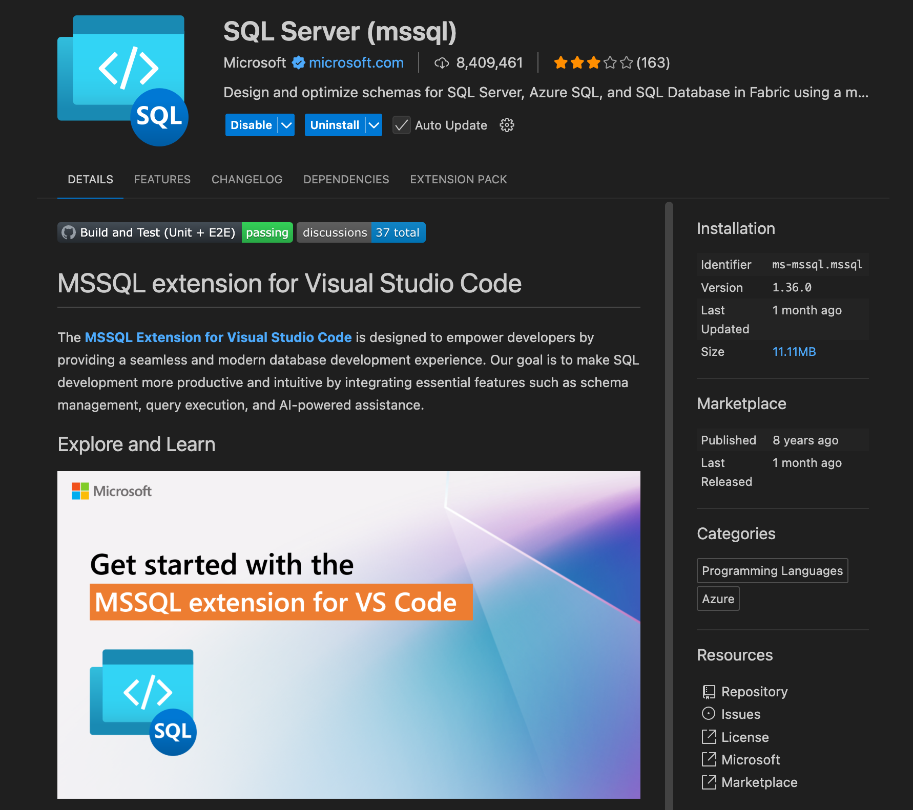
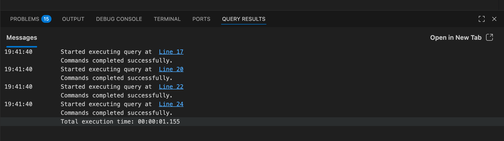
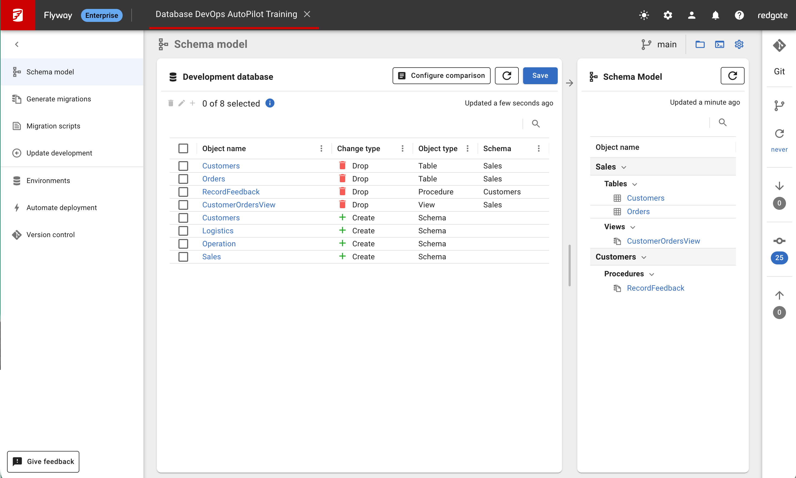
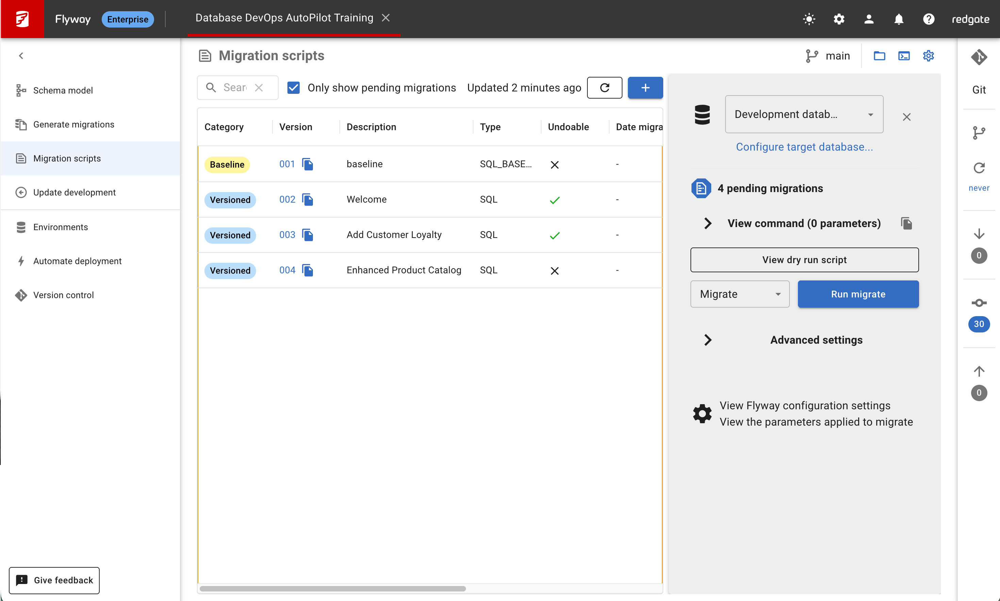

## Overview

In this lab, you'll provision the actual SQL Server databases that your Flyway AutoPilot project will manage. We'll use SQL Server Management Studio (SSMS) to create the databases and then connect them to your Flyway Desktop project.

## Learning Objectives

- Use SQL Server Management Studio or preferred IDE to provision databases
- Execute the database setup script
- Connect provisioned databases to Flyway Desktop
- Verify your AutoPilot environment is ready

## Prerequisites

- Completed Lab 2 (Repository connected to Flyway Desktop)
- Access to Azure SQL Database (e.g., `sqlbits.database.windows.net`)
- Choose one: VS Code with SQL Server extension OR SQL Server Management Studio (SSMS)

## Step 1: Choose Your Database Connection Tool

You can use either of these tools to connect to your Azure SQL Database:

### Option A: VS Code with SQL Server Extension (Recommended for Codespaces)

**Perfect for**: GitHub Codespaces users or developers who prefer VS Code

1. **Install the Extension**:

   - Open VS Code
   - Go to Extensions (Ctrl+Shift+X)
   - Search for "SQL Server (mssql)"
   - Install the official Microsoft extension

   

2. **Benefits**:
   - Works perfectly in Codespaces
   - Integrated with your development environment
   - No additional software needed

### Option B: SQL Server Management Studio (SSMS)

**Perfect for**: Windows users who prefer a full-featured database tool

1. **Download SSMS**:

   - Go to [Download SSMS](https://docs.microsoft.com/en-us/sql/ssms/download-sql-server-management-studio-ssms)
   - Download and install

2. **Benefits**:
   - Full SQL Server functionality
   - Rich database management features
   - Traditional SQL Server experience

## Step 2: Connect to Azure SQL Database

Choose your preferred database management tool for this training.

### VS Code with SQL Server Extension

- **Best for**: Developers already using VS Code or working in GitHub Codespaces
- **Extension**: Install "SQL Server (mssql)" extension

## Step 3: Connect to Your SQL Server

### 1. Connect to Your Azure SQL Database

#### Using VS Code with SQL Server Extension:

1. **Create a New Connection**:

   - Open Command Palette (Ctrl+Shift+P / Cmd+Shift+P)
   - Type: "MS SQL: Connect"
   - Select "Create Connection Profile"

2. **Enter Connection Details**:

   - **Server name**: Your Azure server (e.g., `sqlbits.database.windows.net`)
   - **Database name**: (leave empty for now, or type `master`)
   - **Authentication Type**: SQL Login
   - **User name**: Your SQL Server username
   - **Password**: Your SQL Server password
   - **Profile Name**: Give it a name like "Azure SQL - Training"

3. **Test Connection**: The extension will test and save your connection

#### Using SSMS:

1. Open **SQL Server Management Studio**
2. In the **Connect to Server** dialog:
   - **Server type**: Database Engine
   - **Server name**: Your Azure server (e.g., `sqlbits.database.windows.net`)
   - **Authentication**: SQL Server Authentication
   - **Login**: Your SQL Server username
   - **Password**: Your SQL Server password
3. Click **Connect**

## Step 4: Provision Your AutoPilot Databases

### 1. Execute the Database Setup Script

Now we'll use the database setup script that's already in our repository:

#### Using VS Code:

1. Open the file: `Scripts/CreateAutopilotDatabases.sql` from your repository
2. **Execute the script**:
   - Right-click in the editor → "Execute Query"
   - Or use Command Palette → "MS SQL: Execute Query"
   - Or press **Ctrl+Shift+E**

#### Using SSMS:

1. **File** → **Open** → **File...**
2. Navigate to: `Scripts/CreateAutopilotDatabases.sql`
3. **Execute the script**:

   - Press **F5** or click **Execute**

4. **Review the script** - it will:

   - Check if databases exist and clean them if needed
   - Create `db-autopilot-dev-001` database (Development)
   - Create `db-autopilot-shadow-001` database (Shadow/Validation)
   - Create `db-autopilot-uat-001` database (User Acceptance Testing)
   - Create `db-autopilot-prod-001` database (Production)
   - Set up all required schemas in all databases:
     - **Customers** (default schema)
     - **Logistics**
     - **Operation**
     - **Sales**

5. **Execute the database creation script**:

   **Step 1: Create the databases (connect to master database)**

   - **SSMS**: Press **F5** or click **Execute**
   - **Azure Data Studio**: Click **Run** or press **F5**
   - **VS Code**: Use Command Palette → **MS SQL: Execute Query**

   **Step 2: Schema Setup (Optional - Baseline Migration Will Also Create Schemas)**

   ⚠️ **Important Note**: The baseline migration `B001__baseline.sql` already creates all required schemas. However, if you want to verify schema creation before running Flyway migrations, you can optionally run the schema script.

   **Optional Schema Pre-Setup:**

   Since Azure SQL Database doesn't support `USE` statements, you must connect to each database individually to run the schema creation script:

   **For each database (dev-001, shadow-001, uat-001, prod-001):**

   1. **Connect to the specific database** (not master)
   2. **Run the schema script**: `Scripts/SetupSchemas.sql`
   3. **Verify success** by checking the output messages

   **Alternative**: Use VS Code with SQL Server extension:

   - Create separate connections for each database
   - Run `SetupSchemas.sql` on each connection individually

   **🎯 Recommended Approach**: Skip this step and let Flyway migrations create the schemas automatically when you run `flyway migrate` in the next step.

   

### 2. Update Flyway Configuration for Your Azure SQL Database

Update the `flyway.toml` file with your actual Azure SQL Database connection details:

1. **Open `flyway.toml`** in your repository
2. **Update the connection strings** with your actual Azure SQL Database details:

```toml
[environments.development]
url = "jdbc:sqlserver://YOUR_SERVER.database.windows.net:1433;databaseName=db-autopilot-dev-001;encrypt=true;trustServerCertificate=false"
user = "your_username"
password = "your_password"
displayName = "Development database"

[environments.shadow]
url = "jdbc:sqlserver://YOUR_SERVER.database.windows.net:1433;databaseName=db-autopilot-shadow-001;encrypt=true;trustServerCertificate=false"
user = "your_username"
password = "your_password"
displayName = "Shadow database (validation)"
provisioner = "clean"

[environments.uat]
url = "jdbc:sqlserver://YOUR_SERVER.database.windows.net:1433;databaseName=db-autopilot-uat-001;encrypt=true;trustServerCertificate=false"
user = "your_username"
password = "your_password"
displayName = "UAT (User Acceptance Testing) database"

[environments.production]
url = "jdbc:sqlserver://YOUR_SERVER.database.windows.net:1433;databaseName=db-autopilot-prod-001;encrypt=true;trustServerCertificate=false"
user = "your_username"
password = "your_password"
displayName = "Production database"
```

**Replace these values:**

- `YOUR_SERVER` → Your Azure SQL Server name (e.g., `sqlbits`)
- `your_username` → Your SQL Server login
- `your_password` → Your SQL Server password

**Example with actual values:**

```toml
[environments.development]
url = "jdbc:sqlserver://sqlbits.database.windows.net:1433;databaseName=db-autopilot-dev-001;encrypt=true;trustServerCertificate=false"
user = "sqluser"
password = "MySecurePassword123!"
displayName = "Development database"
```

**Important Security Note:**  
⚠️ For training purposes, we're putting credentials directly in the file. In production environments, you should use environment variables or Azure Key Vault for credential management.

### 3. Verify Database Creation

After executing the script, you should see:

```
db-autopilot-dev-001 Database Created
db-autopilot-shadow-001 Database Created
db-autopilot-uat-001 Database Created
db-autopilot-prod-001 Database Created
Database setup completed successfully - 4 databases ready for AutoPilot training:
  - db-autopilot-dev-001 (Development)
  - db-autopilot-shadow-001 (Shadow/Validation)
  - db-autopilot-uat-001 (User Acceptance Testing)
  - db-autopilot-prod-001 (Production)

Environment Flow: DEV ↔ SHADOW → UAT → PRODUCTION
Shadow database is used for schema drift detection and migration validation.
```

**Verify in Object Explorer/Database List**:

1. Refresh the database list in your SQL tool
2. You should see all four databases:

   - `db-autopilot-dev-001` (Development)
   - `db-autopilot-shadow-001` (Shadow)
   - `db-autopilot-uat-001` (UAT)
   - `db-autopilot-prod-001` (Production)

3. Expand each database → **Security** → **Schemas** (or equivalent)
4. Verify all schemas exist:
   - `Customers`
   - `Logistics`
   - `Operation`
   - `Sales`

## Step 5: Connect Databases to Flyway Desktop

### 1. Return to Flyway Desktop

1. Switch back to **Flyway Desktop**
2. You should still have your project open from Lab 2
3. If not, open the project again:
   - **Open project...** → **Open from disk**
   - Select your `flyway.toml` file

- **It should pop-up for Reload and everything should show up!**

### 2. Check Database Connections

- In Flyway Desktop, you should see **four environments** by clicking on the Environments tab:
  - **Development** (db-autopilot-dev-001)
  - **Shadow** (db-autopilot-shadow-001)
  - **UAT** (db-autopilot-uat-001)
  - **Production** (db-autopilot-prod-001)

### 3. Verify Schema Discovery

1. With a connected environment selected, explore the **schema view**
2. You should see the **four schemas** we created:

   - Customers (default)
   - Logistics
   - Operation
   - Sales

3. **If you ran the optional schema setup**, schemas will be visible immediately
4. **If you skipped schema setup**, schemas will appear after running the baseline migration in the next step



## Step 6: Execute Baseline Migrations

### 1. Deploy the E-Commerce Platform

Now that databases are connected, deploy the baseline e-commerce platform:

1. In Flyway Desktop, select the **Migration Scripts** panel on the left
2. Review the available migration scripts:
   

   - `B001__baseline.sql` - **E-Commerce Platform Foundation** (schemas, customers, products, orders, sample data)
   - `V002__Welcome.sql` - **Welcome Message** (introduces the platform)
   - `V003__Add_Customer_Loyalty.sql` - **Customer Loyalty Program** (points and levels)
   - `V004__Enhanced_Product_Catalog.sql` - **Product Reviews System** (ratings and inventory tracking)

   ℹ️ **Note**: The baseline migration `B001__baseline.sql` creates all required schemas (Customers, Logistics, Operation, Sales), so the manual schema setup in Step 5.2 was optional.

3. Select **Development Database** as your target environment
4. **Execute the migrations**:
   - Click **Run Migrate** button in Flyway Desktop
   - Monitor the migration execution progress

### 2. Migration Results

After successful migration execution, your database contains:

**E-Commerce Platform Components:**

- **Sales.Customers** - International customer base from Germany, Mexico, UK, and Sweden
- **Operation.Products** - Product catalog including iPhone 15 Pro, PlayStation 5, MacBook Air, Nintendo Switch OLED
- **Operation.Categories** - Five product categories: Electronics, Gaming, Books, Sports, Home & Garden
- **Sales.Orders** - Sample orders with shipping costs and delivery dates
- **Sales.CustomerLoyalty** - Multi-tier loyalty system with Bronze/Silver/Gold/Platinum levels
- **Operation.ProductReviews** - Customer review system with five-star ratings

**Business Intelligence Components:**

- Customer order summaries with VIP status indicators
- Product rating summaries with star displays
- Inventory status tracking and alerts

**Stored Procedures:**

- Customer feedback recording with emoji responses
- Inventory management procedures
- Loyalty point calculation workflows

### 3. Verify Platform Deployment

1. **In Flyway Desktop:** Confirm migration history shows all versions completed successfully
2. **In your SQL management tool (SSMS/VS Code):**
   - Refresh your `db-autopilot-dev-001` database and check the `flyway_schema_history`
   - Explore the tables and review the sample data
   - Try this query to see your international customers:

```sql
SELECT CustomerID, CompanyName, City, Country
FROM Sales.Customers
ORDER BY Country, City
```

3. **Check out the product catalog:**

```sql
SELECT p.ProductName, c.CategoryName, p.UnitPrice, p.UnitsInStock
FROM Operation.Products p
JOIN Operation.Categories c ON p.CategoryID = c.CategoryID
ORDER BY c.CategoryName, p.ProductName
```

4. **See the customer loyalty levels:**

```sql
SELECT c.CompanyName, l.TotalPoints, l.LoyaltyLevel
FROM Sales.Customers c
JOIN Sales.CustomerLoyalty l ON c.CustomerID = l.CustomerID
ORDER BY l.TotalPoints DESC
```

## Verification Checklist

Complete the following verification steps to confirm successful setup:

### Database Infrastructure Verification

- [ ] Can connect to your Azure SQL Database server
- [ ] All four databases exist:
  - `db-autopilot-dev-001` (Development)
  - `db-autopilot-shadow-001` (Shadow)
  - `db-autopilot-uat-001` (UAT)
  - `db-autopilot-prod-001` (Production)
- [ ] All four schemas exist in all databases (Customers, Logistics, Operation, Sales)
- [ ] Updated flyway.toml with correct connection strings for your environment

### E-Commerce Platform Verification

- [ ] **Sales.Customers** table contains international customers (ALFKI, ANATR, ANTON, etc.)
- [ ] **Operation.Products** table includes products (iPhone 15 Pro, PlayStation 5, etc.)
- [ ] **Operation.Categories** table contains 5 categories (Electronics, Gaming, Books, Sports, Home & Garden)
- [ ] **Sales.Orders** table contains sample orders with shipping costs
- [ ] **Sales.CustomerLoyalty** table shows loyalty points and levels (Bronze/Silver/Gold/Platinum)
- [ ] **Operation.ProductReviews** table contains customer reviews with ratings

### Flyway Desktop Verification

- [ ] Flyway Desktop shows green connection status for all four environments
- [ ] Can see all 4 environments in the Environments tab:
  - Development (db-autopilot-dev-001)
  - Shadow (db-autopilot-shadow-001)
  - UAT (db-autopilot-uat-001)
  - Production (db-autopilot-prod-001)
- [ ] Migration history shows all 4 migrations completed successfully:
  - B001 (Baseline E-Commerce Platform) ✓
  - V002 (Welcome Message) ✓
  - V003 (Customer Loyalty Program) ✓
  - V004 (Product Reviews System) ✓
- [ ] Schema model is automatically discovered and populated
- [ ] Can see all schemas populated with business tables:
  - Customers schema (created by baseline migration)
  - Logistics schema (created by baseline migration)
  - Operation schema (created by baseline migration)
  - Sales schema (with core tables like Customers, Orders, etc.)

### Sample Data Verification

Execute these queries in your SQL management tool to verify the platform data:

**International Customer Base:**

```sql
SELECT CustomerID, CompanyName, City, Country
FROM Sales.Customers
ORDER BY Country
-- Should show customers from Germany, Mexico, UK, Sweden
```

**Product Catalog:**

```sql
SELECT p.ProductName, c.CategoryName, p.UnitPrice
FROM Operation.Products p
JOIN Operation.Categories c ON p.CategoryID = c.CategoryID
ORDER BY c.CategoryName
-- Should show iPhone, PlayStation, MacBook, Nintendo Switch, etc.
```

**Customer Loyalty Status:**

```sql
SELECT c.CompanyName, l.TotalPoints, l.LoyaltyLevel
FROM Sales.Customers c
JOIN Sales.CustomerLoyalty l ON c.CustomerID = l.CustomerID
ORDER BY l.TotalPoints DESC
-- Should show Bronze/Silver/Gold/Platinum levels
```

**Next Steps:**
In Lab 4, you will learn to:

- Explore the deployed e-commerce platform schema using Flyway Desktop
- Understand the four-environment migration deployment pipeline
- Create schema changes and generate new versioned migrations
- Deploy changes from development to UAT environment using AutoPilot

This training provides a comprehensive foundation in database DevOps practices using real-world, engaging scenarios that students can understand and extend.

## Additional Resources

- [Official Provisioning Guide](https://documentation.red-gate.com/flyway/getting-started-with-flyway/first-steps-flyway-autopilot-a-beginners-guide/flyway-autopilot-fasttrack/3-provisioning-your-databases)
- [SQL Server LocalDB Documentation](https://docs.microsoft.com/en-us/sql/database-engine/configure-windows/sql-server-express-localdb)
- [SSMS Documentation](https://docs.microsoft.com/en-us/sql/ssms/sql-server-management-studio-ssms)

---

## 🔗 Navigation

**⬅️ [Previous: Lab 2 - Repository Configuration](/database-devops-autopilot/training/flyway-autopilot/labs/lab2-repository-configuration)** | **🏠 [Workshop Overview](/database-devops-autopilot/training/flyway-autopilot/labs/)** | **➡️ [Next: Lab 4 - Schema Change Capture](/database-devops-autopilot/training/flyway-autopilot/labs/lab4-schema-change-capture)**

---
