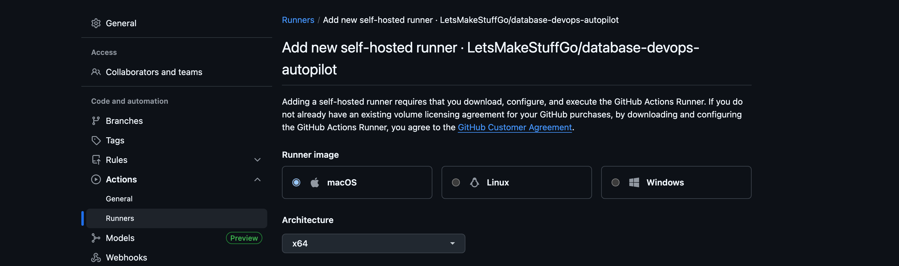
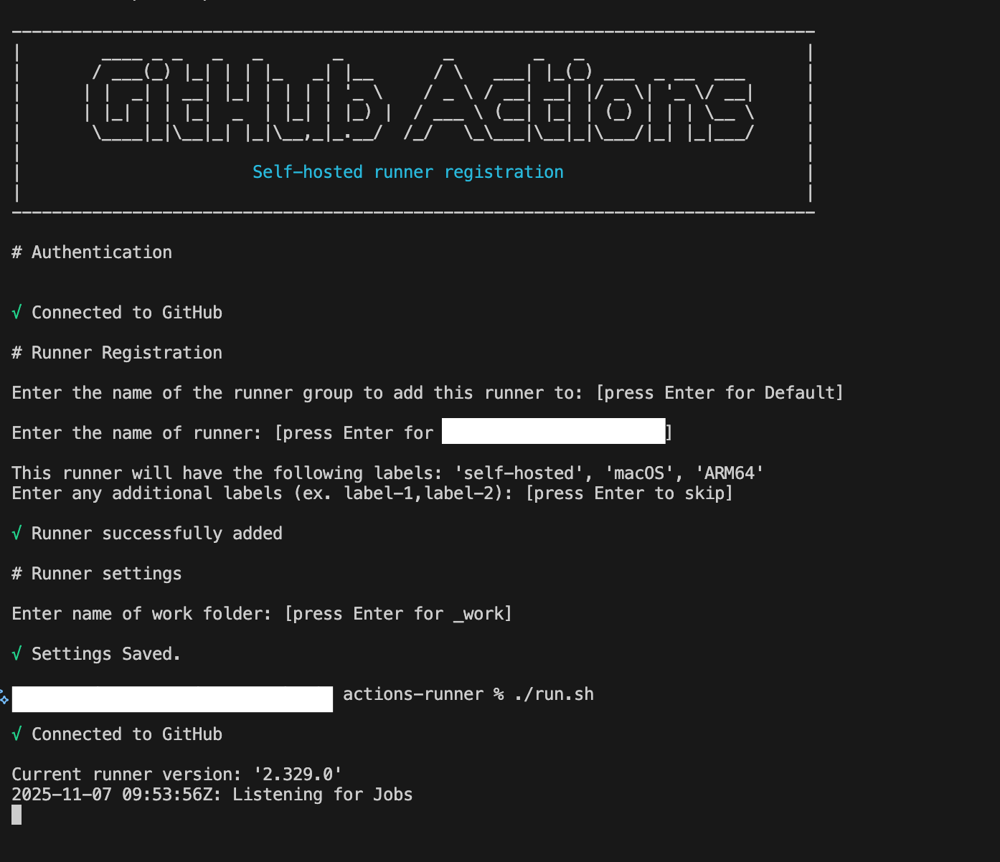
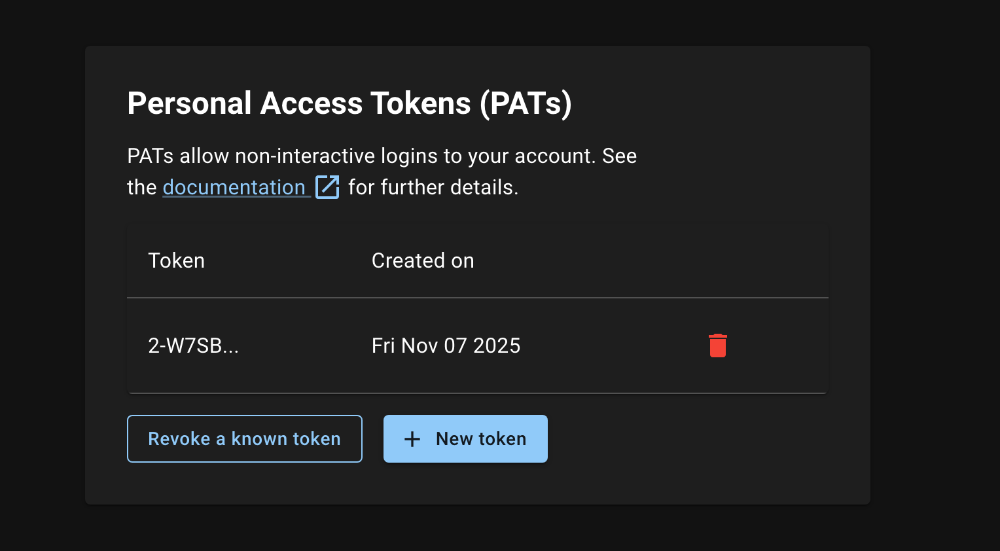
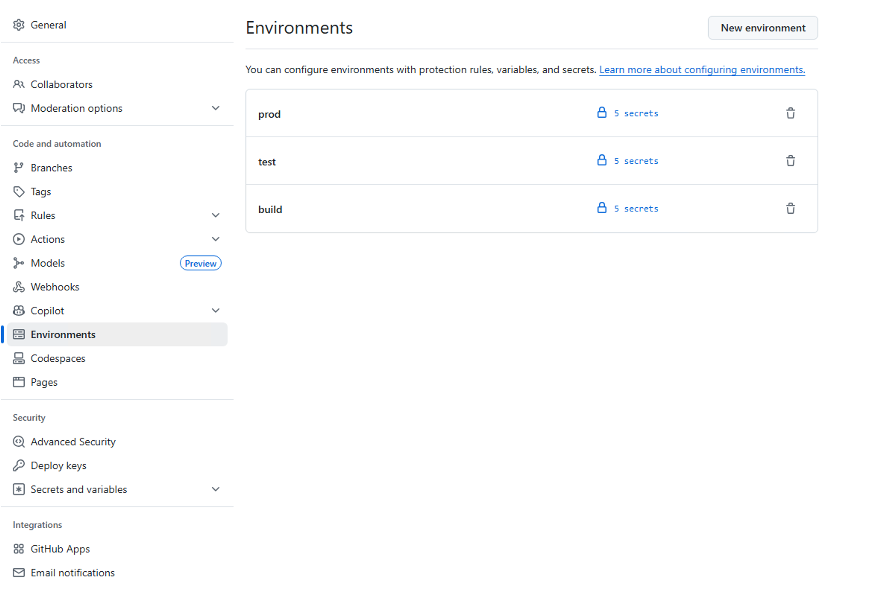
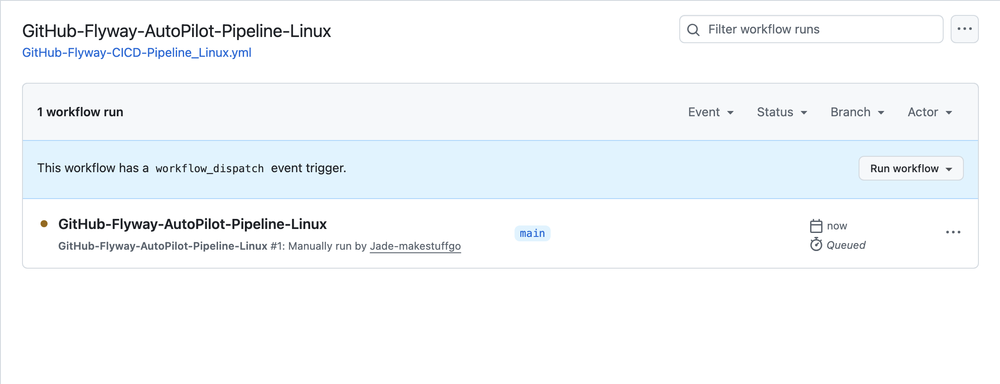
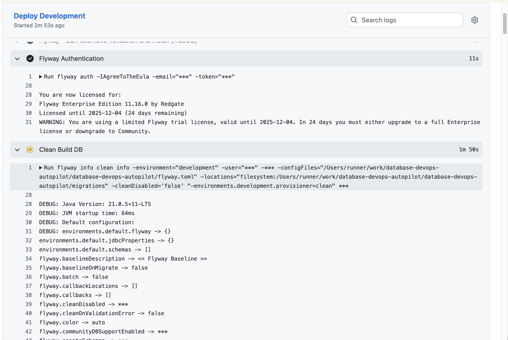
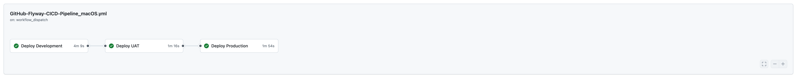
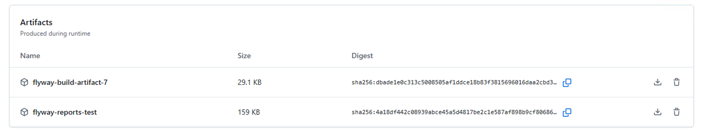
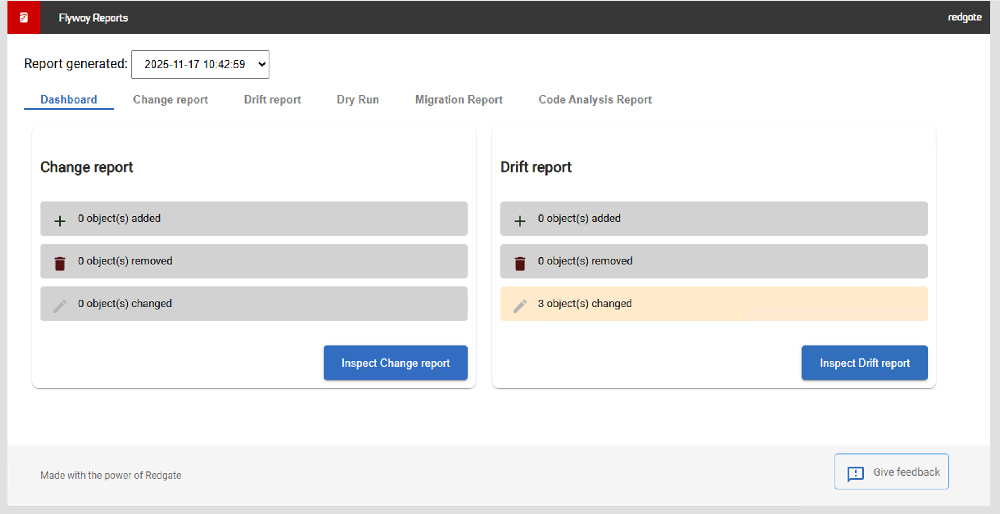

## Overview

Now that you've committed your V005 wishlist migration scripts to your GitHub repository (Lab 5), it's time to set up continuous integration and deployment (CI/CD) using GitHub Actions. This setup will automatically deploy your database changes across all environments, ensuring a smooth and consistent deployment process from development through to production.

## Learning Objectives

- Understand GitHub Actions for database CI/CD automation
- Configure self-hosted runners for Flyway deployment execution
- Set up Personal Access Tokens (PATs) for secure Flyway authentication
- Configure environment-specific database connection secrets
- Deploy wishlist feature to UAT environment using automated pipelines
- Monitor deployment progress and review deployment reports

## Prerequisites

- Completed Lab 5 (V005 migration scripts committed to GitHub)
- GitHub repository with your Flyway project
- Access to create self-hosted runners in GitHub
- Redgate Portal account with Flyway Enterprise license
- Build, Test, and Production databases configured and accessible
- `2.flyway-pipeline.toml` configuration file ready for CI/CD

## Step 1: Navigate to GitHub Actions

### 1. Enable GitHub Actions

1. **Go to your GitHub repository** where your Flyway project is hosted
2. **Click on "Actions"** in the top menu
3. **Enable GitHub Actions** if prompted (you may need repository admin permissions)

### 2. Locate the Workflow Files

Your repository should already contain pre-configured workflow files for different operating systems:

1. **Navigate to `.github/workflows` folder** in your repository
2. **Review the available YAML files**:
   - `GitHub-Flyway-CICD-Pipeline_Windows.yml` - For Windows self-hosted runners
   - `GitHub-Flyway-CICD-Pipeline_Linux.yml` - For Linux self-hosted runners
   - `GitHub-Flyway-CICD-Pipeline_macOS.yml` - For macOS self-hosted runners

**Important:** Do not run any workflows yet - we need to configure the runner, authentication, and update database names first.

## Step 2: Update Database Names in Configuration Files

### 1. Update the CI/CD Configuration File

Before setting up environments, you need to update the database names with your assigned numbers:

1. **Open `2.flyway-pipeline.toml`** in your repository
2. **Replace `xxx` with your assigned numbers** in the database names:

**Replace:**

```toml
[environments.Build]
url = "...databaseName=db-autopilot-dev-xxx;..."

[environments.Test]
url = "...databaseName=db-autopilot-uat-xxx;..."

[environments.Prod]
url = "...databaseName=db-autopilot-prod-xxx;..."
```

**With your assigned numbers (example with 001):**

```toml
[environments.Build]
url = "...databaseName=db-autopilot-dev-001;..."

[environments.Test]
url = "...databaseName=db-autopilot-uat-001;..."

[environments.Prod]
url = "...databaseName=db-autopilot-prod-001;..."
```

### 2. Update the Workflow File

1. **Open `.github/workflows/GitHub-Flyway-CICD-Pipeline_Windows.yml`**
2. **Replace `xxx` with your assigned numbers** in the `DATABASE_NAME` variables:

**Replace:**

```yaml
# Build job
DATABASE_NAME: "db-autopilot-dev-xxx"

# Test job
DATABASE_NAME: "db-autopilot-uat-xxx"

# Prod job
DATABASE_NAME: "db-autopilot-prod-xxx"
```

**With your assigned numbers (example with 001):**

```yaml
# Build job
DATABASE_NAME: "db-autopilot-dev-001"

# Test job
DATABASE_NAME: "db-autopilot-uat-001"

# Prod job
DATABASE_NAME: "db-autopilot-prod-001"
```

### 3. Verify Your Database Access

Make sure you have access to these three databases on the SQL Server:

- `db-autopilot-dev-[your-number]`
- `db-autopilot-uat-[your-number]`
- `db-autopilot-prod-[your-number]`

**Important:** Save and commit these changes before proceeding to environment setup.

## Step 3: Configuring Your Self-Hosted Runner

### 1. Add a Self-Hosted Runner

1. **Navigate to Settings** in your GitHub repository
2. **In the left-hand menu, click "Actions"** then **"Runners"**
3. **Click "New self-hosted runner"**



### 2. Follow Installation Instructions

1. **Select your operating system** (Windows, Linux, or macOS)
2. **Follow the provided instructions** to:
   - Download the runner application
   - Configure the runner with your repository
   - Install as a service (recommended for production)



### 3. Verify Runner Installation

1. **Once installed, return to the Runners page**
2. **Verify your runner appears** as "Idle" status
3. **Note the runner name** for workflow configuration

**The self-hosted runner will execute all Flyway commands in your CI/CD pipeline.**

## Step 4: Adding Personal Access Token (PAT)

### 1. Create a Personal Access Token

A valid Flyway license is required for pipeline authentication. Follow these steps:

1. **Navigate to** [https://identityprovider.red-gate.com/personaltokens](https://identityprovider.red-gate.com/personaltokens)
2. **Login with your Redgate Portal account** (same account used in Flyway Desktop)
3. **Click "+ New Token"** to create a Personal Access Token
4. **Save the token securely** (treat it like a password - you cannot view it again)



### 2. Allocate License to Your Account

1. **Navigate to** [https://portal.red-gate.com/licenses](https://portal.red-gate.com/licenses)
2. **Select "Flyway Enterprise"** from the license list
3. **Click "+ Allocate"** and enter your email address
4. **Click "Add User"** to allocate the license
5. In this case, we might already there, just check.

### 3. Add GitHub Secrets

1. **In your GitHub repository, go to Settings**
2. **Navigate to "Secrets and variables" > "Actions"**
3. **Click "New repository secret"** and create these two secrets:

**Required Secrets:**

```
Secret Name: FLYWAY_EMAIL
Value: [your-redgate-account-email@domain.com]

Secret Name: FLYWAY_TOKEN
Value: [your-personal-access-token-from-step-1]
```

## Step 5: Creating GitHub Environments with Secrets

### 1. Understanding the CI/CD Environment Structure

Your pipeline uses three distinct GitHub environments, each requiring their own secrets configuration:

**Environment Flow:**

```
Build Environment    → Clean validation & artifact creation
         ↓
Test Environment     → Automated UAT deployment
         ↓ (Manual Approval Gate)
Prod Environment     → Production deployment
```

**Database Mapping (from `2.flyway-pipeline.toml`):**

- **Build Environment** → `db-autopilot-dev-[your-number]` database
- **Test Environment** → `db-autopilot-uat-[your-number]` database
- **Prod Environment** → `db-autopilot-prod-[your-number]` database

### 2. Create GitHub Environments

1. **In your GitHub repository, go to Settings**
2. **Click "Environments"** in the left sidebar
3. **Create each environment by clicking "New environment"**:

#### Environment 1: build

1. **Enter environment name**: `build`
2. **Click "Configure environment"**
3. **No protection rules needed** (automatic execution)
4. **Click "Save"**

#### Environment 2: test

1. **Enter environment name**: `test`
2. **Click "Configure environment"**
3. **No protection rules needed** (automatic execution)
4. **Click "Save"**

#### Environment 3: prod

1. **Enter environment name**: `prod`
2. **Click "Configure environment"**
3. **Check "Required reviewers"**
4. **Add yourself** as a required reviewer
5. **Set "Number of required reviewers"** to 1 (Optional!)
6. **Click "Save protection rules"**



### 3. Add Secrets to Each Environment

**You must add the SAME secrets to ALL three environments.** Each environment needs these secrets:

#### Required Secrets for All Environments:

```
SECRET NAME                    VALUE
TARGET_DATABASE_USERNAME    → [your-azure-sql-username]
TARGET_DATABASE_PASSWORD    → [your-azure-sql-password]
FLYWAY_EMAIL                → [your-redgate-account-email]
FLYWAY_TOKEN                → [your-personal-access-token]
FLYWAY_CLI_INSTALL          → true
CUSTOM_PARAMS               → -X (optional - debug mode)
```

#### How to Add Secrets to Each Environment:

**For `build` environment:**

1. **Go to Settings > Environments > build**
2. **Click "Add Secret"** for each secret above
3. **Enter the secret name and value**
4. **Click "Add secret"**

**For `test` environment:**

1. **Go to Settings > Environments > test**
2. **Click "Add Secret"** for each secret above
3. **Enter the same values as build environment**
4. **Click "Add secret"**

**For `prod` environment:**

1. **Go to Settings > Environments > prod**
2. **Click "Add Secret"** for each secret above
3. **Enter the same values as other environments**
4. **Click "Add secret"**

### 4. Why Each Environment Needs the Same Secrets

**Same Database Credentials:** All environments connect to the same Azure SQL Server, just different databases:

- `build` → `db-autopilot-dev-[your-number]` (database name hardcoded in `2.flyway-pipeline.toml` and in GitHub-Flyway-CICD-Pipeline_xxx.yml as well)
- `test` → `db-autopilot-uat-[your-number]` (database name hardcoded in `2.flyway-pipeline.toml` and in GitHub-Flyway-CICD-Pipeline_xxx.yml as well)
- `prod` → `db-autopilot-prod-[your-number]` (database name hardcoded in `2.flyway-pipeline.toml` and in GitHub-Flyway-CICD-Pipeline_xxx.yml as well)

**Same Flyway License:** All environments use the same Flyway Enterprise license for authentication.

### 5. Verify Environment and Secret Setup

After creating all environments and secrets, verify:

1. **Go to Settings > Environments**
2. **Confirm you see 3 environments**: `build`, `test`, `prod`
3. **Click on each environment** and verify it has 6 secrets

**✅ Environment Setup Complete!** You're ready to configure the workflow files.

## Step 6: Verify Workflow Configuration

### 1. Check Your Pipeline Configuration File

Your CI/CD pipeline uses the `2.flyway-pipeline.toml` configuration file instead of the standard `flyway.toml`. This file contains the environment-specific database connections:

**Key Configuration in `2.flyway-pipeline.toml`:**

```toml
[environments.Build]
url = "jdbc:sqlserver://sqlbits.database.windows.net:1433;databaseName=db-autopilot-dev-[your-number];..."
user = "${env.TARGET_DATABASE_USERNAME}"
password = "${env.TARGET_DATABASE_PASSWORD}"

[environments.Test]
url = "jdbc:sqlserver://sqlbits.database.windows.net:1433;databaseName=db-autopilot-uat-[your-number];..."
user = "${env.TARGET_DATABASE_USERNAME}"
password = "${env.TARGET_DATABASE_PASSWORD}"

[environments.Prod]
url = "jdbc:sqlserver://sqlbits.database.windows.net:1433;databaseName=db-autopilot-prod-[your-number];..."
user = "${env.TARGET_DATABASE_USERNAME}"
password = "${env.TARGET_DATABASE_PASSWORD}"
```

### 2. Workflow File Configuration

The GitHub Actions workflow is pre-configured to:

- **Use `2.flyway-pipeline.toml`** for database connections
- **Reference the three environments**: Build, Test, Prod
- **Execute in sequence**: Build → Test → Prod
- **Use environment secrets** for authentication

**Key Workflow Features:**

```yaml
# Uses the CI/CD specific configuration file
configFiles: "${{ GITHUB.WORKSPACE }}/2.flyway-pipeline.toml"

# Authenticates with Redgate using environment secrets
flyway auth -email "${{ secrets.FLYWAY_EMAIL }}" -token "${{ secrets.FLYWAY_TOKEN }}"

# Deploys to environments in sequence
Build Environment → Test Environment → Prod Environment (with approval)
```

### 3. Database Requirements

Ensure you have these three databases created on your Azure SQL Server:

**Required Databases:**

- `db-autopilot-dev-[your-number]` → Used for clean validation (gets wiped each run)
- `db-autopilot-uat-[your-number]` → Used for UAT testing
- `db-autopilot-prod-[your-number]` → Used for production deployment

**Connection Details:**

- **Server**: `sqlbits.database.windows.net` (update in `2.flyway-pipeline.toml` if different)
- **Authentication**: Same username/password for all databases (stored in environment secrets)
- **Encryption**: All connections use SSL/TLS encryption

## Step 7: Running the CI/CD Pipeline

### 1. Trigger the Workflow

1. **Return to the "Actions" tab** in GitHub
2. **Select "GitHub-Flyway-AutoPilot-Pipeline-xxx"** workflow (choose your system according to the runner!)
3. **Click "Run workflow"** button
4. **Confirm the branch** (usually `main`) and click "Run workflow"



### 2. Monitor Build Stage (Automatic)

The first stage performs clean validation:

1. **Click on the workflow run** to monitor progress
2. **Watch the "Deploy Build" job**:
   - ✅ **Clean**: Wipes `db-autopilot-dev-[your-number]` database completely
   - ✅ **Migrate**: Applies all migrations V001-V005 from scratch
   - ✅ **Undo**: Tests rollback scripts for validation
   - ✅ **Artifact**: Publishes validated migration scripts

**Expected Build Output:**

```
✅ Flyway CLI installed successfully
✅ Authenticated with Flyway Enterprise
✅ Cleaned db-autopilot-dev-[your-number] database
✅ Migrated to version 005 (5 migrations applied)
✅ Undo scripts validated successfully
✅ Build artifact published: flyway-build-artifact-[run-number]
```



### 3. Monitor Test Stage (Automatic)

After build completes successfully, test stage begins automatically:

1. **Watch the "Deploy Test" job**:
   - ✅ **Download**: Gets validated artifacts from build stage
   - ✅ **Reports**: Generates deployment preview reports
   - ✅ **Migrate**: Deploys to `db-autopilot-uat-[your-number]` database

### 4. Production Process

After test deployment succeeds, production stage will continue

### 5. Monitor Production Stage (After Approval)

Once approved, production deployment begins automatically:

1. **Watch the "Deploy Prod" job**:
   - ✅ **Reports**: Generates production deployment preview
   - ✅ **Deploy**: Applies V005 to `db-autopilot-prod-[your-number]` database

**Expected Production Output:**

```
✅ Production approval granted by GitHub environment protection
✅ Connected to db-autopilot-prod-[your-number] database
✅ V005 wishlist feature deployed to Production
✅ Production deployment completed successfully
✅ No drift detected across all environments
```

### 6. Complete Pipeline Success

**Final Status Should Show:**

```
Build Environment    → ✅ Clean validation completed
Test Environment     → ✅ UAT deployment successful
Prod Environment     → ✅ Production deployment successful
```

## Step 8: Post-Deployment Verification

### 1. Review Deployment Reports

After successful completion of all three stages:

1. **Check the workflow output** for overall deployment status
2. **Download deployment reports** from workflow artifacts
3. **Review each environment's migration status**

**Expected Success Output:**

```
✅ Build Environment (db-autopilot-dev-[your-number]):
   - Database cleaned and rebuilt successfully
   - All migrations V001-V005 applied
   - Undo scripts validated

✅ Test Environment (db-autopilot-uat-[your-number]):
   - V005 wishlist feature deployed successfully
   - Check reports generated
   - No drift detected

✅ Prod Environment (db-autopilot-prod-[your-number]):
   - Production approval granted
   - V005 wishlist feature deployed successfully
   - Production deployment completed
```



### 2. Download and Review Deployment Artifacts

After a successful pipeline run, GitHub Actions creates downloadable artifacts containing deployment reports and validated migration scripts:

#### **Accessing Pipeline Artifacts**

1. **Navigate to your workflow run** in the GitHub Actions tab
2. **Scroll down to the "Artifacts" section** at the bottom of the workflow summary
3. **You'll see multiple downloadable artifacts**:
   - `flyway-build-artifact-[run-number]` - Validated migration scripts from build stage
   - `flyway-reports-test` - Deployment reports from test environment
   - `flyway-reports-prod` - Deployment reports from production environment



#### **Build Artifact Contents**

The build artifact contains all validated migration files:

1. **Click to download** `flyway-build-artifact-[run-number].zip`
2. **Extract the archive** to review contents:
   ```
   flyway-build-artifact-123/
   ├── migrations/
   │   ├── V001__baseline.sql
   │   ├── V002__Welcome.sql
   │   ├── V003__Add_Customer_Loyalty.sql
   │   ├── V004__Enhanced_Product_Catalog.sql
   │   └── V005__Add_Customer_Wishlist_Feature.sql
   ├── schema-model/
   ├── Scripts/
   ├── flyway.toml
   └── Filter.scpf
   ```

#### **Deployment Report Contents**

The report artifacts contain HTML deployment reports with detailed analysis:

1. **Download** `flyway-reports-test.zip` and `flyway-reports-prod.zip`
2. **Extract and open the HTML files** in your browser
3. **Review the comprehensive deployment analysis**:
   - Database schema changes detected
   - Migration execution summary
   - Drift analysis results
   - Before/after schema comparison



#### **What the Reports Show You**

**Test Environment Report (`db-autopilot-uat-[your-number]`):**

- Changes made during V005 deployment
- Objects created: CustomerWishlists, WishlistItems tables
- Views created: CustomerWishlistAnalytics
- No schema drift detected

**Production Environment Report (`db-autopilot-prod-[your-number]`):**

- Production deployment preview analysis
- Comparison with test environment schema
- Confirmation of successful wishlist feature deployment
- Production schema state verification

#### **Using Reports for Auditing**

These artifacts provide valuable audit trails:

- **Compliance**: Downloadable proof of what was deployed and when
- **Troubleshooting**: Detailed logs if issues occur in environments
- **Documentation**: Schema change history for future reference
- **Validation**: Confirmation that environments are synchronized

**💡 Pro Tip:** Save these artifacts for your deployment documentation and compliance records!

### 4. Verify Wishlist Feature in Production Environment

Connect to your `db-autopilot-prod-[your-number]` database and run the same verification:

```sql

-- Verify production migration history matches test
SELECT version, description, success
FROM [Customers].flyway_schema_history
WHERE success = 1
ORDER BY installed_rank
```

### 5. Build Database Verification

The `db-autopilot-dev-[your-number]` database should contain the complete migrated schema after the build stage completes:

```sql

-- Verify production migration history matches test
SELECT version, description, success
FROM [Customers].flyway_schema_history
WHERE success = 1
ORDER BY installed_rank
```

**Expected Result:** The build database contains all application tables (Sales.Customers, Sales.Products, etc.) plus flyway_schema_history. The build stage cleans the database at the START, then rebuilds it completely to validate all migrations work from scratch.

## Troubleshooting Common Issues

### 1. V005 Migration Failures

If your V005 wishlist migration fails during the CI/CD pipeline, try these solutions:

#### **Problem: "Object already exists" errors**

**Solution:** The V005 migration might conflict with existing objects from previous lab exercises.

```sql
-- Connect to your databases and check for conflicting objects
SELECT name FROM sys.tables WHERE name LIKE '%Wishlist%'
SELECT name FROM sys.views WHERE name LIKE '%Wishlist%'
```

**Quick Fix:** If V005 continues to fail and you want to proceed with the lab:

1. **Delete the V005 migration files** from your `migrations` folder:

   - Delete `V005__Add_Customer_Wishlist_Feature.sql`
   - Delete `U005__UNDO-Add_Customer_Wishlist_Feature.sql` (if exists)

2. **Commit the deletion** to your repository:

   ```bash
   git add migrations/
   git commit -m "Remove V005 migration for CI/CD demo"
   git push
   ```

3. **Re-run the pipeline** - it will now deploy V001-V004 successfully

#### **Problem: Clean provisioner errors**

**Error Message:** `ERROR: Clean is disabled - unable to configure clean provisioner. Please configure a provisioner for the Test environment`

**Solution:** Ensure your `2.flyway-pipeline.toml` has the correct provisioner configuration:

```toml
[environments.Build]
provisioner = "clean"  # Build environment needs this

[environments.Test]
provisioner = "clean"  # Test environment also needs this to avoid failures

[environments.Prod]
# No provisioner for Prod - production safety
```

**Important:** Both Build and Test environments need `provisioner = "clean"` to prevent pipeline failures. Only Production should have no provisioner for safety.

### 2. Authentication Failures

#### **Problem: "Flyway license not found"**

**Solution:**

1. Verify your PAT is correctly set in GitHub secrets
2. Check that your license is allocated in the Redgate Portal
3. Ensure `FLYWAY_EMAIL` matches your Redgate account exactly

### 3. Database Connection Issues

#### **Problem: "Cannot connect to database"**

**Solution:**

1. Verify database names are updated with your assigned numbers
2. Check that all three databases exist on the SQL Server
3. Confirm your credentials work with Azure SQL Server

### 4. Runner Issues

#### **Problem: "No runners available"**

**Solution:**

1. Ensure your self-hosted runner is online and idle
2. Check that the runner service is running
3. Verify the runner has necessary permissions

## Key Concepts Learned

### CI/CD Database Automation

- **Three-Stage Pipeline**: Build validation → Test deployment → Production deployment
- **Environment Isolation**: Each stage uses dedicated databases with identical schemas
- **Clean Build Validation**: Build stage ensures all migrations work from scratch
- **Automated Progression**: Test deployment happens automatically after successful build
- **Manual Production Gate**: Production requires explicit approval for safety
- **Artifact Management**: Build stage creates validated migration packages for downstream stages

### Flyway Enterprise Integration

- **Environment-Specific Configuration**: `2.flyway-pipeline.toml` defines database connections per environment
- **Migration Orchestration**: Flyway handles version sequencing across all environments
- **Drift Detection**: Automatic detection of unauthorized schema changes during deployments
- **Rollback Capability**: Undo scripts validated in build stage for production safety
- **Deployment Reports**: Comprehensive logging and status reporting across pipeline stages

### GitHub Actions Best Practices

- **Environment Secrets Management**: Each environment maintains isolated secret configuration
- **Approval Gates**: Production environment requires manual reviewer approval
- **Self-Hosted Execution**: Control over deployment environment and database connectivity
- **Audit Trail**: Complete history of deployments, approvals, and changes
- **Pipeline as Code**: Deployment workflows defined and versioned in source control

## What You've Accomplished

**Congratulations!** You have successfully completed the Flyway AutoPilot training course!

Throughout this course, you have:

1. **Lab 1**: Set up your development environment and Flyway project
2. **Lab 2**: Configured your repository with proper project structure
3. **Lab 3**: Provisioned databases and deployed your exciting e-commerce platform
4. **Lab 4**: Captured schema changes using AutoPilot workflow
5. **Lab 5**: Generated versioned migration scripts for deployment
6. **Lab 6**: Automated deployments using GitHub Actions CI/CD

### Your E-Commerce Platform Journey

- ✅ **Baseline Deployment**: Complete e-commerce platform with customers, products, orders
- ✅ **Feature Enhancement**: Added customer loyalty program and product reviews
- ✅ **Schema Evolution**: Captured and deployed wishlist functionality using AutoPilot
- ✅ **Clean Build Validation**: Verified all migrations work from scratch in build environment
- ✅ **Multi-Environment Pipeline**: Deployed through Test → Production with approval gates
- ✅ **Production Readiness**: Wishlist feature now live in production environment

### Technical Mastery Achieved

- ✅ **Database DevOps**: End-to-end automated database change management with CI/CD
- ✅ **Version Control**: Git-based workflow for database schema evolution and collaboration
- ✅ **Migration Management**: Flyway-based versioned migration deployment across environments
- ✅ **CI/CD Integration**: GitHub Actions pipeline with build validation and approval gates
- ✅ **Enterprise Practices**: Security, auditing, environment isolation, and deployment best practices
- ✅ **Configuration Management**: Environment-specific configuration with `2.flyway-pipeline.toml`

## Next Steps

Now that you've mastered the fundamentals, continue your Flyway journey:

### Expand Your Skills

- **Explore Advanced Features**: Check mode, dry runs, and rollback procedures
- **Production Deployment**: Extend pipeline to production environment
- **Team Collaboration**: Set up multi-developer workflows and branching strategies
- **Monitoring & Alerts**: Add deployment notifications and failure handling

### Additional Resources

- **Continue Learning**: [Flyway Exercise Book](https://documentation.red-gate.com/flyway/getting-started-with-flyway/first-steps-flyway-autopilot-a-beginners-guide/flyway-autopilot-fasttrack/7-upskilling-with-the-flyway-exercise-book)
- **Join the Community**: [Redgate Forum](https://forum.red-gate.com/) for questions and discussions
- **Enterprise Support**: Contact [Flyway AutoPilot Team](mailto:flywayap@red-gate.com) for advanced scenarios

**You are now a Database DevOps expert with Flyway AutoPilot!**

## Additional Resources

- [GitHub Actions Documentation](https://docs.github.com/en/actions)
- [Flyway CI/CD Best Practices](https://documentation.red-gate.com/flyway/deploying-database-changes-using-flyway)
- [Personal Access Tokens Guide](https://documentation.red-gate.com/authentication/personal-access-tokens-pats)
- [Redgate Portal License Management](https://portal.red-gate.com/licenses)

---

## 🔗 Navigation

**⬅️ [Previous: Lab 5 - Migration Script Generation](/database-devops-autopilot/training/flyway-autopilot/labs/lab5-migration-script-generation)** | **🏠 [Workshop Overview](/database-devops-autopilot/training/flyway-autopilot/labs/)**

---

## 🎉 Congratulations!

You've completed the Flyway AutoPilot workshop! You now have:

- ✅ A complete database DevOps pipeline
- ✅ Automated schema capture and migration generation
- ✅ CI/CD deployment automation
- ✅ Best practices for database version control

**Continue your database DevOps journey with the Redgate community and documentation!**
